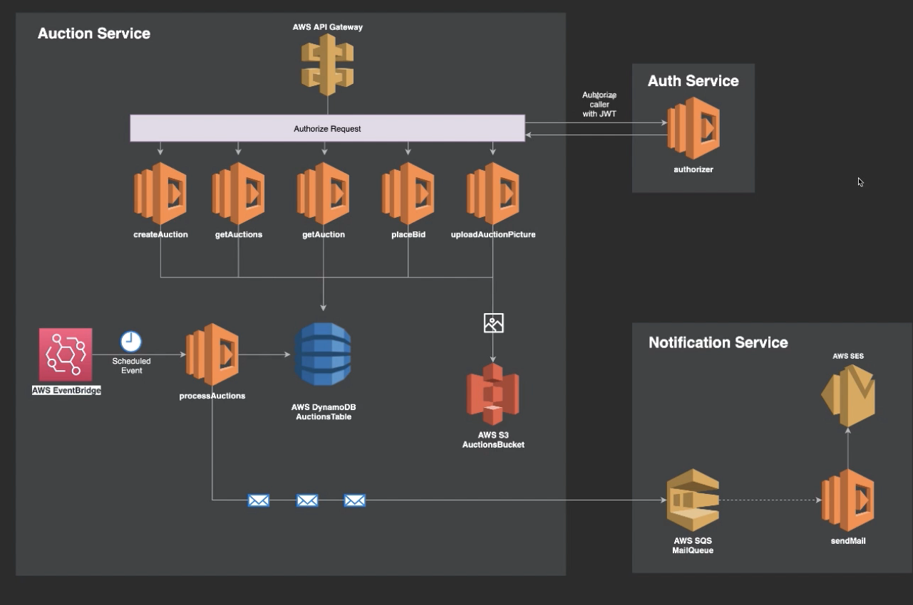

## Auctions Service
A serverless application example, Using Nodejs Lambda services and AWS SQS, AWS S3, AWS SES, Auth0.

[postman collection](https://www.getpostman.com/collections/ff9c47ce2d6ce52885d4)

### todo
- [] add unit testing
- [] create cd / cd pipeline
